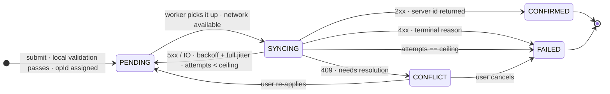
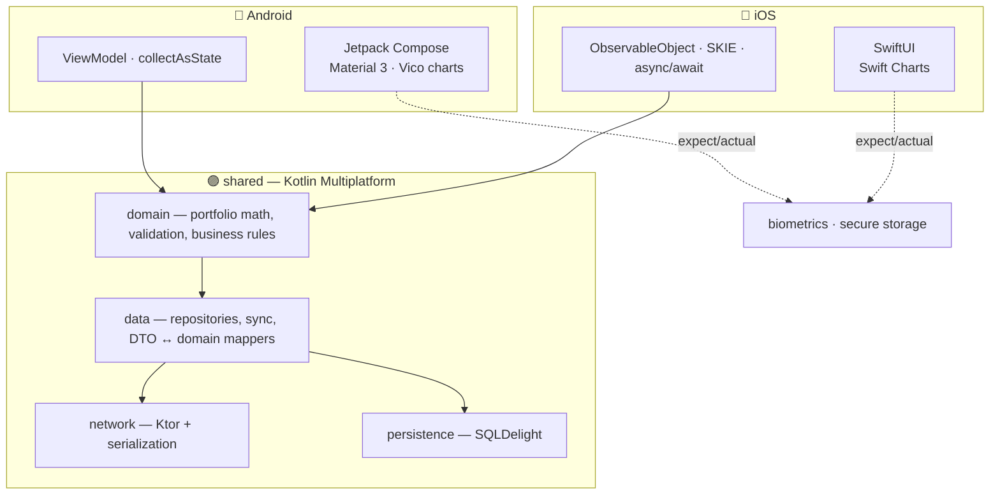

<!-- ────────────────────────────────────────────────────────────────────────── -->

<div align="center">


<br/>

<a href="https://www.linkedin.com/in/chinmaytayade"></a>&nbsp;
<a href="mailto:chinmaytayade@outlook.com"></a>&nbsp;


<br/><br/>


</div>

<!-- ────────────────────────────────────────────────────────────────────────── -->

## &nbsp;`whoami`

Mobile engineer building **B2C fintech-grade** Android apps — the kind where a
dropped connection mid-transfer, a stolen unlocked phone, or a schema migration
gone wrong are *design inputs*, not afterthoughts. Primary stack: **Android ·
Kotlin · Jetpack Compose · Kotlin Multiplatform**. IIIT Allahabad.

```kotlin
object Chinmay {
    val core       = listOf("Android", "Kotlin", "Jetpack Compose", "KMP")
    val breadth    = listOf("iOS / SwiftUI", "Flutter", "React Native")
    val domain     = listOf("digital banking", "payments", "ledgers", "KYC onboarding")
    val obsessions = listOf(
        "what NOT to share in KMP",
        "eventual consistency as a UX contract",
        "a test suite you actually trust",
    )
    val default    = "boring, well-understood tools — until the novel one earns its place"
}
```

<!-- ────────────────────────────────────────────────────────────────────────── -->

## &nbsp;The signature problem: a transfer you don't fully control

The user taps **Send** with no signal. What does a serious banking client do?
Not spin. Not lie. It persists the intent, shows the truth, and reconciles later.

<details>
<summary><b>Open the offline transfer state machine</b></summary>

<br/>



- **Idempotency key** (`opId`, client-generated) persisted *before* any network
  attempt → a retried request the server already saw returns the original result.
- **Optimistic UI** — the transfer appears instantly as `PENDING`, de-emphasised,
  with retry / cancel. The app never claims success it can't verify.
- **Backoff** is exponential with *full jitter* and a ceiling — so every device
  that went offline in an outage doesn't stampede the server when it returns.
- **Conflict resolution is per operation type**, not one global rule.

Built out in **[argent-android](https://github.com/chinmay-tayade/argent-android)**,
then extracted into a standalone `offline-sync-engine`.

</details>

<!-- ────────────────────────────────────────────────────────────────────────── -->

## &nbsp;Kotlin Multiplatform: share the logic, keep the UI native

<details>
<summary><b>Open: what I share vs. what I deliberately keep native</b></summary>

<br/>



**Shared:** everything that's expensive to get wrong twice — domain logic, data,
networking, persistence. One implementation, one test suite, run on JVM *and*
Kotlin/Native. **Native:** all UI, navigation, charts, notifications, biometric
prompts — the things users actually feel. The decision, module by module, is
written up in `SHARING.md`.

Built in **basis-kmp** *(next up)*.

</details>

<!-- ────────────────────────────────────────────────────────────────────────── -->

## &nbsp;Featured work

<table>
<tr>
<th align="left" width="210">Repo</th><th align="left">What it demonstrates</th><th align="left" width="90">Status</th>
</tr>

<tr><td valign="top">

**[argent-android](https://github.com/chinmay-tayade/argent-android)**
<br/><sub>digital banking</sub>

</td><td valign="top">

Multi-module Kotlin/Compose retail banking app. Foundation shipped —
convention plugins, a currency-safe domain layer with tests, Hilt-wired app,
green CI. Building toward the offline transfer state machine, biometric
Keystore encryption, cert pinning and Baseline Profiles ([roadmap](https://github.com/chinmay-tayade/argent-android/blob/main/ROADMAP.md)).

<sub>`kotlin` `compose` `multi-module` `offline-first` `mvi` `fintech` `mobile-security`</sub>

</td><td valign="top"><br/>🟢 building</td></tr>

<tr><td valign="top">

**basis-kmp**
<br/><sub>KMP · Android + iOS</sub>

</td><td valign="top">

Shared Kotlin financial core (portfolio valuation, cost basis, allocation) across
Android and iOS, with fully native Compose and SwiftUI UIs. Ships `SHARING.md` —
the module-by-module share-vs-native rationale.

<sub>`kotlin-multiplatform` `compose` `swiftui` `ktor` `sqldelight` `koin`</sub>

</td><td valign="top"><br/>⚪ next</td></tr>

<tr><td valign="top">

**ledger-core**
<br/><sub>KMP library</sub>

</td><td valign="top">

A pure-Kotlin **double-entry ledger**: accounts, postings, immutable transactions,
idempotency, a `Money` type with correct rounding and currency safety. The fintech
fundamentals, heavily tested, multiplatform.

<sub>`kotlin-multiplatform` `fintech` `ledger` `double-entry` `library`</sub>

</td><td valign="top"><br/>⚪ planned</td></tr>

<tr><td valign="top">

**pay-sheet**
<br/><sub>payments module</sub>

</td><td valign="top">

A drop-in Compose **checkout / payment-sheet** module: card input with Luhn +
network detection, tokenization flow, 3-D-Secure-style step-up, PCI-conscious
design notes. Small, focused, production-shaped.

<sub>`android` `compose` `payments` `checkout` `3ds`</sub>

</td><td valign="top"><br/>⚪ planned</td></tr>

<tr><td valign="top">

**offline-sync-engine**
<br/><sub>library</sub>

</td><td valign="top">

The sync core from `argent-android`, standalone and Maven-published: operation
queue, exponential backoff + jitter, pluggable conflict strategies, connectivity
observation.

<sub>`android` `offline-first` `sync` `workmanager` `library`</sub>

</td><td valign="top"><br/>⚪ planned</td></tr>

<tr><td valign="top">

**modulith**
<br/><sub>architecture template</sub>

</td><td valign="top">

Opinionated Android architecture: Gradle convention plugins, a CI check that fails
builds on module-graph violations, wired-in benchmark + baseline-profile setup,
demonstrated with a non-trivial sample app.

<sub>`android` `gradle` `convention-plugins` `architecture` `ci`</sub>

</td><td valign="top"><br/>⚪ planned</td></tr>

<tr><td valign="top">

**android-perf-lab**
<br/><sub>performance</sub>

</td><td valign="top">

Baseline Profiles + Macrobenchmark run against `argent-android`. Real numbers,
real methodology, real before/after — every measurement carries its device,
build type and iteration count.

<sub>`android` `performance` `baseline-profiles` `macrobenchmark`</sub>

</td><td valign="top"><br/>⚪ planned</td></tr>

</table>

> Then, one at a time, we build each: scaffold → local `./gradlew build` green →
> feature commits → tests → CI → README. Honest history, no big-bang dumps.

<!-- ────────────────────────────────────────────────────────────────────────── -->

## &nbsp;Toolbox

<p>


&nbsp;


</p>
<p>


&nbsp;


</p>
<p>


&nbsp;


</p>

<!-- ────────────────────────────────────────────────────────────────────────── -->

## &nbsp;How I think about engineering

| Principle | In practice |
|---|---|
| **Design for the failure case first** | No signal, stolen device, mid-migration — that's where the architecture is decided |
| **Share logic, not UI** | KMP: domain + data shared, UI native. Knowing *what not to share* is the skill |
| **Measure before claiming a win** | A perf number ships with its device, build type and iteration count — or it doesn't ship |
| **Trust the test suite** | Hand-written fakes over brittle mocks; cover the logic that moves money |
| **Boring by default** | Proven tools until a new one earns its place |

<!-- ────────────────────────────────────────────────────────────────────────── -->

<details>
<summary>&nbsp;<b>GitHub activity</b></summary>

<br/>

<div align="center">


</div>

</details>

<br/>

<picture>
  <source media="(prefers-color-scheme: dark)" srcset="https://raw.githubusercontent.com/chinmay-tayade/chinmay-tayade/output/github-contribution-grid-snake-dark.svg"/>
  
</picture>

<div align="center">

</div>
