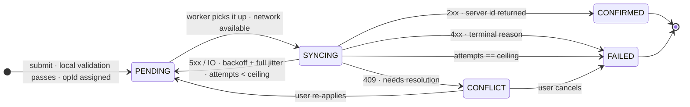
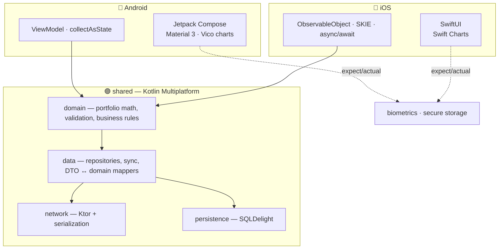

<!-- ────────────────────────────────────────────────────────────────────────── -->

<div align="center">


<br/>

<a href="https://www.linkedin.com/in/chinmaytayade"></a>&nbsp;
<a href="mailto:chinmaytayade@outlook.com"></a>&nbsp;


<br/><br/>


</div>

<!-- ────────────────────────────────────────────────────────────────────────── -->

## &nbsp;`whoami`

Mobile engineer building **B2C fintech-grade** Android apps — the kind where a
dropped connection mid-transfer, a stolen unlocked phone, or a schema migration
gone wrong are *design inputs*, not afterthoughts. Primary stack: **Android ·
Kotlin · Jetpack Compose · Kotlin Multiplatform**. IIIT Allahabad.

```kotlin
object Chinmay {
    val core       = listOf("Android", "Kotlin", "Jetpack Compose", "KMP")
    val breadth    = listOf("iOS / SwiftUI", "Flutter", "React Native")
    val domain     = listOf("digital banking", "payments", "ledgers", "KYC onboarding")
    val obsessions = listOf(
        "what NOT to share in KMP",
        "eventual consistency as a UX contract",
        "a test suite you actually trust",
    )
    val default    = "boring, well-understood tools — until the novel one earns its place"
}
```

<!-- ────────────────────────────────────────────────────────────────────────── -->

## &nbsp;The signature problem: a transfer you don't fully control

The user taps **Send** with no signal. What does a serious banking client do?
Not spin. Not lie. It persists the intent, shows the truth, and reconciles later.

<details>
<summary><b>Open the offline transfer state machine</b></summary>

<br/>



- **Idempotency key** (`opId`, client-generated) persisted *before* any network
  attempt → a retried request the server already saw returns the original result.
- **Optimistic UI** — the transfer appears instantly as `PENDING`, de-emphasised,
  with retry / cancel. The app never claims success it can't verify.
- **Backoff** is exponential with *full jitter* and a ceiling — so every device
  that went offline in an outage doesn't stampede the server when it returns.
- **Conflict resolution is per operation type**, not one global rule.

The engine lives in **[offline-sync-engine](https://github.com/chinmay-tayade/offline-sync-engine)**
(9 tests, standalone); it gets wired into **[argent-android](https://github.com/chinmay-tayade/argent-android)** behind WorkManager.

</details>

<!-- ────────────────────────────────────────────────────────────────────────── -->

## &nbsp;Kotlin Multiplatform: share the logic, keep the UI native

<details>
<summary><b>Open: what I share vs. what I deliberately keep native</b></summary>

<br/>



**Shared:** everything that's expensive to get wrong twice — domain logic, data,
networking, persistence. One implementation, one test suite, run on JVM *and*
Kotlin/Native. **Native:** all UI, navigation, charts, notifications, biometric
prompts — the things users actually feel. The decision, module by module, is
written up in `SHARING.md`.

Built in **[basis-kmp](https://github.com/chinmay-tayade/basis-kmp)** — shared domain + `SHARING.md` done, Android app runs, iOS framework links.

</details>

<!-- ────────────────────────────────────────────────────────────────────────── -->

## &nbsp;Featured work

### &nbsp;&nbsp;Flagships &nbsp;·&nbsp; where most of the effort goes

<table>
<tr>
<td width="33.33%" valign="top">

**🏦 &nbsp;[argent&#8209;android](https://github.com/chinmay-tayade/argent-android)**

<sub>*Retail digital banking · offline&#8209;first*</sub>

Multi&#8209;module Kotlin/Compose. Foundation shipped — convention plugins, a
currency&#8209;safe domain layer with tests, Hilt&#8209;wired app, green CI.
The offline transfer state machine is next.

<kbd>kotlin</kbd> <kbd>compose</kbd> <kbd>multi&#8209;module</kbd> <kbd>offline&#8209;first</kbd> <kbd>fintech</kbd>

</td>
<td width="33.33%" valign="top">

**🧩 &nbsp;[basis&#8209;kmp](https://github.com/chinmay-tayade/basis-kmp)**

<sub>*Shared Kotlin core · Android + iOS*</sub>

One financial core — portfolio valuation, cost basis, allocation — shared via
Koin, with fully native Compose and SwiftUI UIs. Shared domain + tests done,
Android app runs, iOS framework links. Ships **`SHARING.md`**: the
module&#8209;by&#8209;module share&#8209;vs&#8209;native call.

<kbd>kmp</kbd> <kbd>compose</kbd> <kbd>swiftui</kbd> <kbd>koin</kbd> <kbd>ios</kbd>

</td>
<td width="33.33%" valign="top">

**📒 &nbsp;[ledger&#8209;core](https://github.com/chinmay-tayade/ledger-core)**

<sub>*Double&#8209;entry ledger · KMP library*</sub>

Pure Kotlin: balanced journal entries, idempotent postings, a `Money` type
with currency safety. The fintech fundamentals — 12 tests, JVM + iOS, green CI.

<kbd>kmp</kbd> <kbd>fintech</kbd> <kbd>ledger</kbd> <kbd>library</kbd>

</td>
</tr>
</table>

### &nbsp;&nbsp;Also building &nbsp;·&nbsp; focused supporting repos

<table>
<tr>
<td width="50%" valign="top">

**💳 &nbsp;[pay&#8209;sheet](https://github.com/chinmay-tayade/pay-sheet)** &nbsp;<sub>*checkout / payment&#8209;sheet module*</sub>

Card input with Luhn + brand detection, tokenization, a 3&#8209;D&#8209;Secure&#8209;style
step&#8209;up state machine, PCI&#8209;conscious notes. 11 tests, sample app.

<kbd>android</kbd> <kbd>compose</kbd> <kbd>payments</kbd> <kbd>3ds</kbd>

</td>
<td width="50%" valign="top">

**🔄 &nbsp;[offline&#8209;sync&#8209;engine](https://github.com/chinmay-tayade/offline-sync-engine)** &nbsp;<sub>*standalone sync library*</sub>

Durable operation queue, exponential backoff + full jitter, pluggable
per&#8209;operation conflict strategies. 9 tests, green CI.

<kbd>offline&#8209;first</kbd> <kbd>workmanager</kbd> <kbd>library</kbd>

</td>
</tr>
<tr>
<td width="50%" valign="top">

**🏗️ &nbsp;[modulith](https://github.com/chinmay-tayade/modulith)** &nbsp;<sub>*Android architecture template*</sub>

Gradle convention plugins + a `checkModuleGraph` task that fails the build on
module&#8209;graph violations — verified catching a `core → feature` edge.

<kbd>gradle</kbd> <kbd>convention&#8209;plugins</kbd> <kbd>architecture</kbd>

</td>
<td width="50%" valign="top">

**⚡ &nbsp;android&#8209;perf&#8209;lab** &nbsp;<sub>*measured performance — queued*</sub>

Baseline Profiles + Macrobenchmark against argent&#8209;android — real
before/after with device + iteration count. Sequenced after argent has real
screens worth measuring.

<kbd>performance</kbd> <kbd>baseline&#8209;profiles</kbd> <kbd>macrobenchmark</kbd>

</td>
</tr>
</table>

> Each is built the same way: scaffold → `./gradlew build` green → feature
> commits → tests → CI → README. Honest history, no big&#8209;bang dumps.

<!-- ────────────────────────────────────────────────────────────────────────── -->

## &nbsp;Toolbox

<p>


&nbsp;


</p>
<p>


&nbsp;


</p>
<p>


&nbsp;


</p>

<!-- ────────────────────────────────────────────────────────────────────────── -->

## &nbsp;How I think about engineering

| Principle | In practice |
|---|---|
| **Design for the failure case first** | No signal, stolen device, mid-migration — that's where the architecture is decided |
| **Share logic, not UI** | KMP: domain + data shared, UI native. Knowing *what not to share* is the skill |
| **Measure before claiming a win** | A perf number ships with its device, build type and iteration count — or it doesn't ship |
| **Trust the test suite** | Hand-written fakes over brittle mocks; cover the logic that moves money |
| **Boring by default** | Proven tools until a new one earns its place |

<!-- ────────────────────────────────────────────────────────────────────────── -->

<details>
<summary>&nbsp;<b>GitHub activity</b></summary>

<br/>

<div align="center">


</div>

</details>

<br/>

<picture>
  <source media="(prefers-color-scheme: dark)" srcset="https://raw.githubusercontent.com/chinmay-tayade/chinmay-tayade/output/github-contribution-grid-snake-dark.svg"/>
  
</picture>

<div align="center">

</div>
